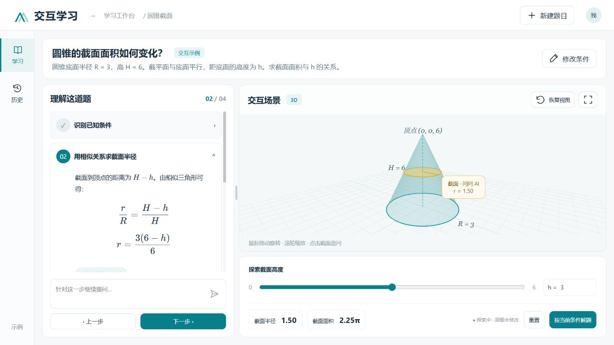
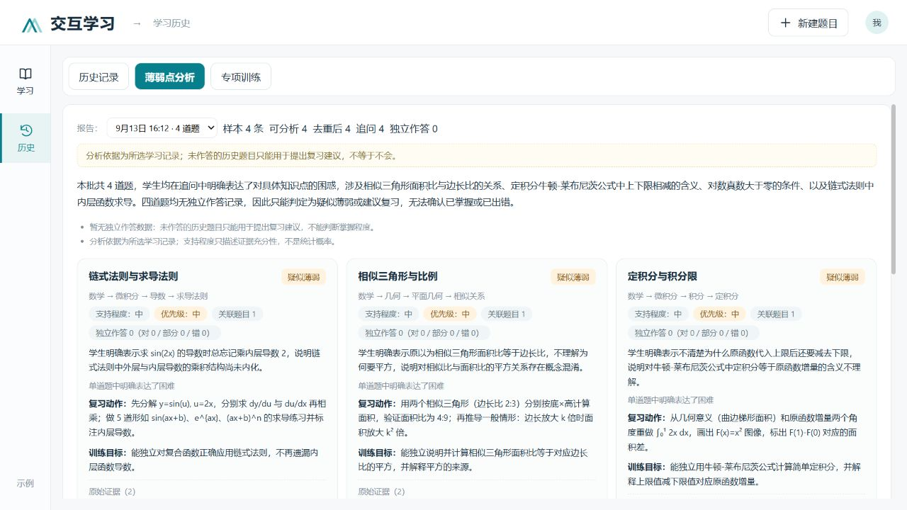
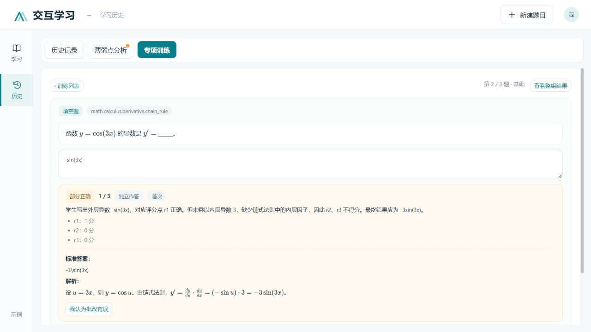

# AI 解题助手 (AI Math Problem Solver)

## 项目成果展示

[20 张功能截图与 PPT 配文](docs/showcase/README.md) · [离线截图目录](docs/showcase/index.html)







截图采用内置示例及人工准备的演示题，解答、分析和训练反馈通过实际接口生成，不代表真实学生成绩。完整素材目录包含 OCR 校正、函数图像、证据追溯、训练配置和结果更新等场景。

基于 DeepSeek V4.1 Flash 的多模态智能解题应用，支持文字输入与图片上传，通过分层处理生成结构化解题步骤，并由前端渲染交互式数学图形。支持浅色/深色模式切换。

## 技术栈

| 层 | 技术 |
|------|------|
| **前端** | React 18, Axios, Create React App |
| **后端** | Node.js, Express.js |
| **AI** | DeepSeek V4.1 Flash (`deepseek-flash`) |
| **OCR** | 百度 OCR API |
| **可视化** | Python + Matplotlib (由后端自动调用) |

## 项目结构

```
├── backend/
│   ├── server.js              # Express 服务入口（createApp 与启动监听分离，便于测试）
│   ├── routes/
│   │   ├── conversations.js   # 对话 CRUD + 消息处理（复用共享 repository）
│   │   └── learning.js        # 学习历史：分析报告 / 专项训练 / 作答 / 任务轮询
│   ├── repositories/
│   │   ├── conversationRepository.js  # 全局唯一的内存对话数据源（消息 ID/revision/来源）
│   │   └── learningRepository.js      # 分析、训练、作答、草稿的内存仓库（TTL + 级联删除）
│   ├── services/
│   │   ├── historyEvidenceService.js  # 历史证据规范化、追问抽取、去重、可分析性评估
│   │   ├── learningAnalysisService.js # 分批知识点提取 → 汇总 → 后端证据规则 → 报告
│   │   ├── practiceService.js         # 出题、复核、提示/揭晓释放、作答与首答锁
│   │   ├── gradingService.js          # 规则判题（单选/保守填空）+ 模型批改
│   │   └── learningJobService.js      # 任务队列：幂等、合并、取消、总截止时间
│   ├── validators/learningSchemas.js  # 输入与模型输出结构校验
│   ├── config/knowledgeTaxonomy.js    # 稳定知识点字典（math-v1）
│   ├── prompts/                       # 分析 / 出题 / 复核 / 批改 提示词
│   ├── tests/                         # node:test 自动化测试（mock 模型，不访问真实 API）
│   ├── models/
│   │   └── Conversation.js    # 对话数据模型 (Mongoose Schema，当前运行时未接入)
│   └── utils/
│       ├── llmService.js      # DeepSeek 多模态 API 调用 + 绘图提示词模板 + JSON 验证
│       ├── apiError.js        # 统一业务错误 {error:{code,message,retryable,details}}
│       └── ocrService.js      # 百度 OCR 文字识别
├── frontend/
│   ├── public/
│   │   └── index.html
│   └── src/
│       ├── App.js             # 主应用组件（对话状态、结构化来源字段）
│       ├── api/learningApi.js # /api/learning 客户端与错误归一化
│       ├── hooks/useLearningJobs.js # 任务轮询（1.5s、失败退避、卸载清理）
│       ├── components/
│       │   ├── LearningWorkspace.js    # 学习工作台 + 学习历史视图切换
│       │   ├── MathMarkdown.js         # 公共数学文本渲染组件
│       │   ├── history/                # HistoryWorkspace 及记录/报告/训练子组件
│       │   ├── InputArea.js   # 输入区域（文本 + 图片上传）
│       │   ├── GeometryViewer.js      # 几何图形查看器
│       │   └── Interactive3DViewer.js # 3D 交互查看器
│       └── history.css        # 学习历史视图样式
├── start.bat                  # Windows 一键启动脚本
└── start.ps1                  # PowerShell 一键启动脚本
```

## 核心流程

### 解题管线

当用户发送一条问题消息时，后端执行：

1. **步骤拆解**: 调用 DeepSeek V4.1 Flash 分析文字与题目图片，输出结构化解题步骤和绘图数据（JSON），多次校验失败时降级为回显原题（消息标记为 `fallback` 状态）。
2. **前端渲染**: 前端根据结构化绘图数据渲染 2D 函数或交互式 3D 图形，不再调用第二个模型生成 Python 代码。
3. **答案合成**: `thirdLayerLLM` 在本地按「先图后文」拼接最终答案，不再额外请求模型。

### OCR 图片识别流程

用户上传图片后：
1. 图片上传到后端进行 OCR 识别
2. 识别结果展示在输入框上方，用户可编辑修改
3. 用户确认后，原始图片、OCR 文字与用户输入文本一同提交给 DeepSeek 多模态模型处理

### 提示词设计

**防幻觉机制**：
- 每步标注依据的定理/公式/条件，禁止编造数据
- 不确定时列出多种可能并说明适用条件
- 文本长度控制：每步不超过150字，summary 不超过80字

**图像生成策略**：默认优先生成。函数图→`MATH_STATIC_EQUATION`，几何→`MATH_STATIC_ABSTRACT`，动态→`MATH_DYNAMIC_GEOMETRY`，物理→`PHYSICS_ENGINE`，化学→`CHEMISTRY_CRYSTAL`。仅纯代数/逻辑推理时不生成。

### 第一层 JSON 格式验证

第一层 LLM 输出会经过 `validateAndFixFirstLayerResult` 严格校验：
- `tryExtractJSON`: 先清洗 markdown 代码块标记，再修复常见 JSON 格式问题（缺引号、尾逗号），然后解析
- 验证 `steps` 数组存在且非空
- 校验每个步骤的 `id`、`description`、`needImage`、`imageType` 字段类型
- `imageType` 必须在 6 种预定义类型中选择，支持大小写不敏感的匹配
- `needImage` 支持字符串 `"true"`/`"True"` 格式的解析
- `needImage` 为 `false` 时自动修正 `imageType` 为 `NO_IMAGE`
- 验证失败时自动重试（最多 2 次），提示 LLM 修正格式

### 支持的图像类型

| 类型 | 说明 |
|------|------|
| `MATH_STATIC_EQUATION` | 函数图像（有明确解析式） |
| `MATH_DYNAMIC_GEOMETRY` | 动态几何演示（GIF 动画） |
| `MATH_STATIC_ABSTRACT` | 抽象概念可视化 |
| `CHEMISTRY_CRYSTAL` | 晶胞结构 3D 模型 |
| `PHYSICS_ENGINE` | 基础物理模拟（如抛体运动） |

### 图片上传 + OCR

用户可上传题目图片。后端保留百度 OCR 作为可编辑的文字预览，同时把 Base64 原图与文本一起提交给 DeepSeek V4.1 Flash 进行视觉理解。

## 特性

- **环境自动检测**: 启动时自动检测 Python、matplotlib、numpy、pillow、API Key 等依赖，缺失时弹出图形化指引
- **深色模式**: 右上角一键切换浅色/深色主题
- **智能路由**: 自动判断输入是否为题目——题目走多层分步解题+图像生成流程，普通对话走简洁模式
- **停止生成**: 思考中将发送按钮变为红色停止按钮，点击立即中止 AI 生成
- **修改重问**: 最近一次用户消息气泡左下角有编辑按钮，点击可修改提问并自动删除旧问答后重新发送
- **OCR 保护**: OCR 结果必须展示至少 1 秒后才能确认发送，防止误触
- **对话删除中止**: 删除对话时自动中止正在进行的 AI 生成
- **空对话自动清理**: 切换对话时自动清理空对话
- **3D 交互模型**: 几何类题目自动展示可拖拽旋转+滚轮缩放的3D视图
- **固定页面布局**: 聊天区域独立滚动，页面高度始终为视口大小
- **思考状态隔离**: 思考动画仅显示在当前对话中

## 前置要求

- **Node.js** >= 16.x
- **Python** >= 3.8（需安装 matplotlib, numpy, pillow）
- **MongoDB**（可选，当前使用内存存储）

### 安装 Python 依赖

```bash
pip install matplotlib numpy pillow
```

## 快速开始

1. **克隆项目并安装依赖**

```bash
cd backend && npm install
cd ../frontend && npm install
cd ..
```

2. **配置 API Key**

编辑 `backend/.env`，填入你的 API Key：

```env
PORT=5000
DEEPSEEK_API_URL=https://api.deepseek.com/chat/completions
DEEPSEEK_API_KEY=你的DeepSeek_API_Key
DEEPSEEK_MODEL=deepseek-flash
BAIDU_OCR_API_KEY=你的百度OCR_API_Key
BAIDU_OCR_SECRET_KEY=你的百度OCR_Secret_Key
```

3. **启动服务**

Windows 用户双击 `start.bat` 或运行：

```bash
# 终端1: 启动后端
cd backend && node server.js

# 终端2: 启动前端
cd frontend && npm start
```

4. **打开浏览器访问** `http://localhost:3001`

## 学习历史：薄弱点分析与专项训练

在左侧导航「历史」进入完整学习历史视图，包含三个页签：

### 核心原则

**提问历史 ≠ 错题历史，提问频次 ≠ 不掌握程度。**

- 只有题目主题：展示「涉及的知识点／建议复习」，不断言学生不会。
- 学生明确表达不理解（追问中含疑问）：展示「疑似薄弱点」并列出原始证据摘录。
- 收集到学生独立作答后：才展示「训练中出现错误／部分掌握」等真实表现。
- 不生成「掌握度 37%」这类无依据数值；「支持程度」只描述证据充分性（低/中/高）。
- AI 解答、服务调用失败、重复提问都不会被当成学生错误；静态示例内容默认排除。
- 判断由模型提出，但所有统计、优先顺序、支持程度上限由后端按固定规则计算，模型伪造的知识点/证据 ID 会被校验拒绝并触发一次修复。

### 使用流程

1. **历史记录**：按最近 7 天 / 30 天 / 全部筛选（默认 30 天），默认选中最近 20 条可分析记录（可改选，单次最多 50 条），点击「分析所选记录」。
2. **薄弱点分析**：查看知识点卡片（判断类型、支持程度、优先顺序、原始证据摘录、可跳回原题），勾选 1～3 个知识点生成训练。
3. **专项训练**：选择题量（3/5）与难度（基础/标准/挑战），逐题作答（单选/填空/简答），可「给我提示」或「直接看答案」（两者都会使本题按辅助练习记录，不计入独立表现）；提交后获得批改反馈，可对存疑批改提出争议、对失败批改重试。
4. **更新分析**：整组训练完成后出现「有新的训练证据，可更新分析」，点击后用真实作答更新报告。

### 可靠性约定

- **自动知识点归类**：预置目录之外的内容由 AI 对照已有名称、别名、定义与边界进行归并；已有概念复用编号，确实新增的概念自动建立稳定编号，可用于分析、出题和批改。知识点、题型与具体困难分别记录；同名但不同学科含义的概念不会仅凭名称强行合并。
- **分类持续保存**：新增知识点与别名保存在 `backend/data/knowledge-registry.json`，重启后保留。可通过 `KNOWLEDGE_REGISTRY_PATH` 指定文件位置。当前为单后端进程实现，归并判定与写入串行执行；多进程部署前需接入共享数据库和事务。题目、报告和训练仍采用下述内存存储。
- **跨学科训练**：学习历史不再按“非数学”直接排除。出题、复核及批改会收到知识点的学科与定义；跨学科填空交由模型评估，避免错误地忽略代码中的大小写或空白。旧版报告含待处理概念时，打开报告会自动启动重新分析。模型或网络失败时明确报错，不用随意分类伪装成功。

- **异步任务**：分析、出题、批改均为「创建任务 + 轮询状态」，支持取消、幂等（requestKey/submissionKey）、有限修复重试与 10 分钟总截止。
- **答案隔离**：标准答案、评分点、完整提示只保存在后端；未作答时所有公开接口不返回答案。
- **独立性判定**：是否「首次独立作答」由服务端根据提示/揭晓记录与作答顺序判定，客户端无法声明。
- **级联删除**：删除原对话会删除其分析报告、派生训练与作答并取消相关任务；删除报告/训练也有对应的级联规则。
- **内存存储**：报告与训练默认保留 7 天、任务记录 24 小时（上限各 200 份），**服务重启后全部清空**；界面已明确提示。
- **单用户假设**：当前与对话功能一致，无用户隔离；接入多用户前需要为所有 repository 查询增加 owner 校验。

### 运行后端测试

```bash
cd backend && npm test
```

测试使用固定 mock 模型输出，不依赖付费接口，覆盖：证据抽取与去重、伪造 ID 拒绝与修复、证据等级/优先顺序规则、判题规则与模型批改、任务幂等/取消/来源变化、接口级完整闭环、并发首答冲突、级联删除等 38 个场景。

## API 接口

### 对话与 OCR

| 方法 | 路径 | 说明 |
|------|------|------|
| GET | `/api/conversations` | 获取所有对话列表 |
| POST | `/api/conversations` | 创建新对话（可传 `source` 标记来源） |
| GET | `/api/conversations/:id` | 获取指定对话详情 |
| POST | `/api/conversations/:id/message` | 发送消息（支持 `source/kind/studentQuestion/activeStepId` 结构化来源字段） |
| POST | `/api/conversations/:id/message-stream` | SSE 流式消息 |
| POST | `/api/conversations/:id/abort` | 停止当前生成 |
| DELETE | `/api/conversations/:id` | 删除对话（级联删除关联分析与训练） |
| POST | `/api/ocr` | 图片 OCR 识别 |

### 学习历史（`/api/learning`）

| 方法 | 路径 | 说明 |
|------|------|------|
| GET | `/history?from=&to=&cursor=&limit=` | 可分析记录摘要（服务端返回可分析状态与原因） |
| POST | `/analyses` | 创建分析任务，`202 {jobId}` |
| GET | `/analyses` / `/analyses/:id` | 报告列表 / 报告详情（含 stale 与 pendingEvidence） |
| DELETE | `/analyses/:id` | 删除报告并级联删除派生训练 |
| GET | `/jobs/:id` | 查询任务状态；POST `/jobs/:id/cancel` 取消 |
| POST | `/practice-sessions` | 创建出题任务，`202 {jobId}` |
| GET | `/practice-sessions` / `/:id` / `/:id/result` | 训练列表 / 训练详情（不含答案）/ 整组统计 |
| DELETE | `/practice-sessions/:id` | 删除训练（关联报告标记过期） |
| PATCH | `/practice-sessions/:id/draft` | 保存作答草稿（版本号防回退） |
| POST | `/practice-sessions/:id/questions/:qid/hint` | 释放下一条提示（记录辅助行为） |
| POST | `/practice-sessions/:id/questions/:qid/reveal` | 查看答案（结束该题独立测验机会） |
| POST | `/practice-sessions/:id/attempts` | 提交作答；规则判题即时返回，模型批改返回 `202 {jobId}` |
| GET | `/attempts/:id` | 批改状态与反馈（批改完成或揭晓后附答案） |
| POST | `/attempts/:id/retry-grading` | 重试失败批改（复用同一次作答） |
| POST | `/attempts/:id/dispute` | 标记批改争议（排除该项确认成绩） |

错误统一为 `{error:{code,message,retryable,details}}`，覆盖 `INVALID_INPUT`、`NOT_FOUND`、`SOURCE_CHANGED`、`IDEMPOTENCY_CONFLICT`、`ATTEMPT_IN_PROGRESS`、`INSUFFICIENT_DATA`、`CAPACITY_LIMIT`、`LLM_INVALID_OUTPUT` 等。

## 更新记录

### 2026-09-11（学习历史与专项训练）

- **学习历史视图**: 「历史」入口由窄抽屉扩展为完整视图（历史记录 / 薄弱点分析 / 专项训练三个页签），保留原记录查看与删除能力，支持按最近 7/30 天/全部筛选、默认选中最近 20 条可分析记录。
- **薄弱点分析**: 基于所选历史记录分批提取知识点与困难线索，汇总为带原始证据引用的分析报告；后端强制执行「提问 ≠ 做错」的证据规则（assessment 降级、支持程度上限、透明优先顺序），并支持指纹缓存复用与 forceRefresh。
- **专项训练**: 围绕知识点出题（3/5 题、三档难度）+ 独立模型复核；单选/填空规则判题、简答模型批改（按评分点求和，可返回 uncertain）；提示渐进释放、答案揭晓、草稿防抖保存、争议标记与批改重试。
- **数据基础**: 抽取全局 `conversationRepository`（消息补齐 `_id/kind/status/metadata`、对话 `revision/source`，同步与 SSE 两个入口统一写入）；新增学习功能内存仓库、任务服务（幂等/合并/取消/截止）与统一错误约定。
- **工程化**: server.js 拆分 `createApp()` 便于测试；新增 `node:test` 自动化测试 38 例（mock 模型，不访问真实 API）并补充 `npm test`；`llmService.callLLMStructured` 向下兼容扩展 `signal/timeoutMs/temperature/taskType` 选项，学习类调用不再输出正文日志。
- **已知限制**: 报告/训练/作答为内存存储（默认 7 天 TTL、上限 200 份），重启即清空；无多用户隔离；未接入向量检索与长期统计。

### 2026-09-11
- **模型统一**: 文本、标题和视觉理解统一切换至 DeepSeek V4.1 Flash（`deepseek-flash`），移除运行时 AIHubMix 依赖
- **多模态接入**: 上传题目图片时，将原始图片以 OpenAI 兼容的 `image_url` 内容块传给 DeepSeek
- **配置统一**: 环境变量统一为 `DEEPSEEK_API_URL`、`DEEPSEEK_API_KEY` 和 `DEEPSEEK_MODEL`
- **结构化输出修复**: 解题步骤与绘图参数关闭额外思考输出、启用 JSON 输出约束并提高正文额度，避免复杂图片题退化为复制原题

### 2026-06-13
- **`\n` 换行修复**: `tryExtractJSON` 中反斜杠保护不再覆盖 `\n` 转义，同时在 `renderContent` 中将字面 `\n` 转为实际换行
- **AI 输出质量提升**: system prompt 新增"杜绝自我质疑与犹豫"规则，禁止输出中出现 `？注意：...`、`实际上...` 等思考/推翻过程；提示词新增宽松化+多小问分别图像生成规则
- **3D 坐标系修正**: 从 `[pt.x, pt.z, pt.y]` 改为右手系 `[pt.x, pt.z, -pt.y]`（(+X)×(+Y)=+Z 成立）；轴线标签上移避免被 XY 平面截断；默认相机和 OrbitControls target 设在原点
- **LaTeX 渲染重写**: 先保护已有 `$...$`/`$$...$$` 块、再对裸 LaTeX 做 fallback 包裹；不再粗暴剥离所有 `$`
- **JSON 解析增强**: `tryExtractJSON` 重写——括号深度扫描 + 引号缺失修复 + 反斜杠保护，解决 `\cos`/`\frac`/`\sqrt` 等被 `JSON.parse` 破坏的问题
- **环境检测修复**: 修正 API Key 检测——由读取不存在的 `LLM_API_KEY` 改为检测 `AIHUBMIX_API_KEY` 和 `DEEPSEEK_API_KEY`
- **环境检测增强**: 新增 `sympy` 库检测，快速安装提示同步更新

### 2026-06-12
- **双模型路由**: 普通对话/分类/标题/参数提取使用 DeepSeek V4 Pro，仅3D几何代码生成使用 Claude Sonnet 4.6
- **交互式3D模型**: 几何类题目优先使用Three.js在浏览器中直接渲染可拖拽缩放的3D模型，不再依赖Python生成的静态PNG
- **下标坐标解析**: 新增`x₀=1, y₀=√2, z₀=0`格式的坐标提取，自动识别点名称并构建3D顶点
- **右键菜单删除**: 右键点击侧边栏对话弹出红色删除菜单项
- **边自连接算法**: 多层级分组匹配连接各层环+垂直棱，小集完全图fallback确保所有点有线相连
- **LaTeX渲染**: 正则passes剥除`$`并包裹`\cmd{...}`+`_^`表达式为KaTeX格式；移除第一卦限坐标限制
- **3D坐标系**: Z轴=竖直轴，底面XY平面，标准右手系
- **多面体提示词**: 圆柱/圆锥/圆台/棱柱/棱锥等完整顶点+边绑定规则，点边严格对应

### 2026-06-10
- **编辑按钮移至气泡**: 修改最近一次提问的编辑按钮移至最近用户消息气泡左下角，更小更不显眼
- **编辑后删除旧消息**: 修改提问时自动删除修改前的提示词和对应的AI回答
- **3D模型生成修复**: 修复`extractGeometryParams`/`extractFunctionParams`/`extractAnimationParams`中JSON解析失败时返回原始对象而非Python代码的问题；在Python执行前添加`matplotlib.use('Agg')`确保无GUI环境可正常运行
- **启动脚本修复**: 修复`start.bat`闪退问题——改用绝对路径(`%~dp0`)、增加错误提示、逐步骤显示进度

## 注意事项

- 当前对话、分析报告、训练与作答数据都存储在**后端内存**中，重启后端后数据会丢失。如需持久化，需要真正接入数据库（添加连接、repository 实现、Schema 与迁移，处理现有 `conv_*` 字符串 ID），仅在 `.env` 配置 `MONGODB_URI` 不会自动启用数据库。
- 标准答案与评分点只保存在服务端；学习历史功能遵循与主应用一致的单用户假设，未提供多用户隔离。
- Python 绘图生成的图片保存为 `/tmp/figure.png` 或 `/tmp/animation.gif`，Windows 下会自动转换为 `backend/tmp/` 目录。
- DeepSeek API 调用超时设置为 180 秒；学习类任务另有 10 分钟总截止与全局并发上限（默认 2，可通过 `LEARNING_MAX_CONCURRENT` 等环境变量调整）。
- DeepSeek 第一层 JSON 解析含自动重试机制，最多重试 2 次。
- **安全提醒**: 请勿将包含真实 API Key 的 `.env` 文件提交到公开仓库。

### 参数联动图形

解题生成的 `drawingData.interaction`（version 1）支持最多三个数学参数滑块、点坐标/截面/函数公式绑定，以及实时指标。截面、动点和函数参数变化题会要求模型生成交互关系；服务端校验并最多重试两次，前端也会校验。非法关系保留静态图并显示提示，拖动遇到无效位置则保留上一个有效状态。

协议与例子见 `backend/prompts/interactive-scene.txt`；前后端共用 `frontend/src/utils/parameterScene.mjs` 的受限算术解释器，不执行模型生成的 JavaScript。后端加载此共享模块需支持 require(ESM) 的 Node.js（本机验证版本为24）。项目部署时应保留共享模块。改变参数只影响当前探索图形；“按当前状态追问”会附带参数和指标，不修改原题。

旧解题记录没有联动关系，需要重新解题后生成。修改后端提示词或校验逻辑后需重启后端；当前内存记录仍受原有重启清空限制。

### Windows 桌面程序

根目录的 `desktop/` 将现有前后端封装为 Electron 免安装程序，使用独立的本机端口。运行程序无需另装 Node.js 或 Python；AI 解题需要联网及 DeepSeek 密钥，图片识别另外需要百度 OCR 配置。首次启动可填写连接信息或先体验内置示例，之后在菜单「EL学习助手 → AI 连接设置」修改。密钥使用 Windows 用户级加密保存，不嵌入 EXE。

构建：分别安装根目录和 frontend 的 npm 依赖，然后在根目录运行 `npm run build:desktop`。产物为 `dist/EL-Learning-1.0.0-x64.exe`。桌面构建将 API 地址设为同源 `/api`，包含 backend 运行代码、提示词、前端构建和共享参数模块；排除 .env、历史数据、测试与源映射。依赖下载可按需设置 ELECTRON_MIRROR / ELECTRON_BUILDER_BINARIES_MIRROR；发布前应验证下载文件的校验值。

桌面版沿用当前记录存储方式：题目、报告与训练关闭后会清空，退出时会确认；知识点目录和 API 连接配置保留在当前用户的应用数据目录。当前开发服务的数据不会迁移到桌面版。
